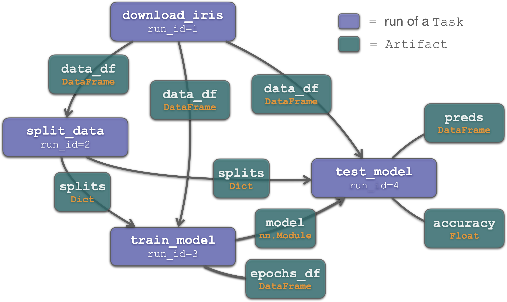

# 🌍 terra
A Python package that transforms free-form research workflows into reproducible pipelines. 

## 🚀 Getting started
Using `terra` to track your research workflows begins with a simple decorator, `Task.make_task`! For example's sake, let's assume we're trying to train a model to classify plants of the genus _Iris_ (see [Iris dataset](https://archive.ics.uci.edu/ml/datasets/iris)). As a first step, let's write a function that downloads the dataset for this project. We'll turn it into a `terra.Task` using a decorator:
```python
from terra import Task
import pandas as pd 

@Task.make_task
def download_iris(url: str, run_dir: str = None):
    return pd.read_csv(url)

data_df = download_iris("https://raw.github...")

>> task: download_iris, run_id=1
```
A couple things to notice: 
1. __`run_id`__ – When we call `download_iris`, the run is recorded in the `terra` database and assigned a unique `run_id`. At any time in the future, we can use that `run_id` to fetch info about the run: `terra.inp(run_id=1)`, `terra.get_meta(run_id=1)`, `terra.get_log(run_id=1)`, `terra.get_run_dir(run_id=1)`.  
2. __`Artifact`__ – Objects returned from a `Task` are serialized and written to disk. If you inspect `data_df`, you'll notice that it's not actually a Pandas DataFrame but rather a `terra.io.Artifact`. In `terra`, an `Artifact` is simply a pointer to an object that was created by a task run and written to disk. To access the underlying DataFrame, we can just call `data_df.load()`. Later on, in a different python process or notebook, we can access this artifact same artifact by simply calling `terra.out(run_id=1)`.    

Let's create a second `Task` for the next step of our project: splitting the dataset into training and test splits:
```python
@Task.make_task
def split_data(df: pd.DataFrame, train_frac: float=0.8, run_dir: str = None):
    mask = np.random.rand(len(df)) < train_frac
    return {"train": mask, "test": ~mask}

splits = split_data(df=data_df, train_frac=0.7)

>> task: split_data, run_id=2
```
Notice how we passed `data_df`, an `Artifact`, directly to `split_data` __without__ calling `data_df.load()`. When you pass an `Artifact` to a `Task`, `terra` automatically loads it and, most importantly, records in the terra database that an `Artifact` generated by `download_iris, run_id=1` was used by `split_data, run_id=2`. 



__Key__ 🔑 –  By passing `data_df` to `split_data`, we have implicitly established a link between our runs of the `download_iris` and `split_data` tasks. As we add more tasks (e.g. `train_model` and `test_model`) and run them passing in the output artifacts of the earlier tasks, we build up a Directed Acyclic Graph (DAG) where nodes are `Task` runs and edges are `Artifact`s passed between those runs. This is neat because at any point in our project, we can take any `Artifact` (be it a DataFrame, np.array, torch model, or matplotlib plot) and trace the pipeline that created it all the way back to the roots of the DAG (e.g. the initial data download). 


## ⚙️ Installation and Setup
Clone the terra repo and install using pip:
```bash
git clone https://github.com/seyuboglu/terra.git
pip install -e path/to/terra
```

Create a `terra_config.json` file for your project:
```json
{
    "storage_dir": "path/to/storage/dir",
    "slack_web_client_id": "xoxb...",
    "notify": true
}
```

Set the `TERRA_CONFIG_PATH` variable in your environment to point to your new `terra_config.json` (you'll need to reactivate the environment): 
```bash
conda env config vars set TERRA_CONFIG_PATH="path/to/terra_config.json"
conda activate env_name
```
